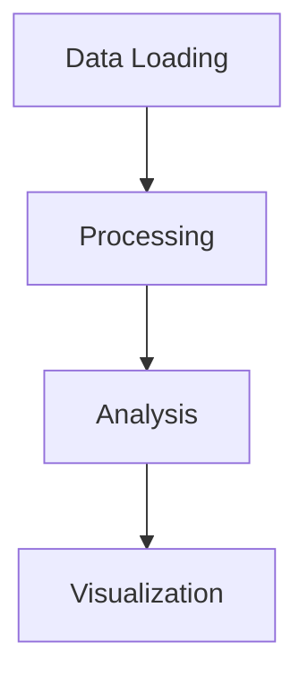

# Past1000 Documentation

This directory contains the complete documentation for the Past1000 library, built with MkDocs and Material theme.

## Documentation Structure

```
docs/
├── index.md                    # Homepage
├── getting-started/            # Getting started guides
│   ├── installation.md
│   ├── quickstart.md
│   └── configuration.md
├── api/                       # API reference
│   ├── data.md
│   ├── compare.md
│   ├── calibration.md
│   ├── filters.md
│   ├── abm.md
│   ├── process.md
│   ├── constants.md
│   └── utils.md
├── examples/                  # Usage examples
│   ├── basic-usage.md
│   ├── advanced-analysis.md
│   └── abm-simulation.md
└── development/               # Development guides
    ├── contributing.md
    ├── testing.md
    └── changelog.md
```

## Building the Documentation

### Prerequisites

Install the documentation dependencies:

```bash
pip install -r requirements-docs.txt
```

### Local Development

Serve the documentation locally for development:

```bash
mkdocs serve
```

The documentation will be available at `http://localhost:8000`.

### Building

Build the documentation for production:

```bash
mkdocs build
```

The built documentation will be in the `site/` directory.

### Deployment

Deploy to GitHub Pages:

```bash
mkdocs gh-deploy
```

## Documentation Features

### Material Theme Features

- **Responsive Design**: Works on desktop, tablet, and mobile
- **Dark/Light Mode**: Toggle between themes
- **Search**: Full-text search across all documentation
- **Navigation**: Hierarchical navigation with tabs and sections
- **Code Highlighting**: Syntax highlighting for code blocks
- **Admonitions**: Callout boxes for important information
- **Tabs**: Tabbed content for multiple code examples
- **Math**: LaTeX math support
- **Diagrams**: Mermaid diagram support

### MkDocs Plugins

- **mkdocstrings**: Automatic API documentation generation
- **search**: Built-in search functionality
- **material**: Material Design theme
- **pymdown-extensions**: Additional markdown extensions

## Writing Documentation

### Markdown Extensions

The documentation supports several markdown extensions:

#### Admonitions

```markdown
!!! note "Note"
    This is a note.

!!! warning "Warning"
    This is a warning.

!!! tip "Tip"
    This is a tip.
```

#### Code Blocks

```python
def example_function():
    """Example function."""
    return "Hello, World!"
```

#### Tabs

```markdown
=== "Python"
    ```python
    import past1000
    ```

=== "R"
    ```r
    library(past1000)
    ```
```

#### Math

```markdown
The correlation coefficient is calculated as:

$$r = \frac{\sum_{i=1}^{n}(x_i - \bar{x})(y_i - \bar{y})}{\sqrt{\sum_{i=1}^{n}(x_i - \bar{x})^2\sum_{i=1}^{n}(y_i - \bar{y})^2}}$$
```

#### Diagrams

```markdown

```

### API Documentation

API documentation is automatically generated from docstrings using mkdocstrings.

#### Function Documentation

```python
def example_function(param1: str, param2: int = 10) -> bool:
    """Example function with parameters.

    Args:
        param1: First parameter
        param2: Second parameter with default value

    Returns:
        Boolean result

    Example:
        >>> result = example_function("test", 20)
        >>> print(result)
        True
    """
    return True
```

#### Class Documentation

```python
class ExampleClass:
    """Example class with methods.

    Attributes:
        attribute1: First attribute
        attribute2: Second attribute
    """

    def __init__(self, value: int):
        """Initialize the class.

        Args:
            value: Initial value
        """
        self.attribute1 = value
        self.attribute2 = value * 2
```

## Customizing the Documentation

### Configuration

The documentation is configured in `mkdocs.yml`:

```yaml
site_name: Past1000 API Documentation
theme:
  name: material
  features:
    - navigation.tabs
    - navigation.sections
    - search.highlight
    - content.code.copy
```

### Styling

Custom CSS can be added in `docs/stylesheets/extra.css`:

```css
/* Custom styles */
.custom-class {
    color: #ff6b6b;
}
```

### Plugins

Additional plugins can be added to `mkdocs.yml`:

```yaml
plugins:
  - search
  - mkdocstrings
  - mkdocs-material
  - your-custom-plugin
```

## Contributing to Documentation

### Adding New Pages

1. Create a new markdown file in the appropriate directory
2. Add the page to the navigation in `mkdocs.yml`
3. Write the content following the style guide
4. Test locally with `mkdocs serve`

### Updating API Documentation

1. Update the docstrings in the Python code
2. The documentation will be automatically updated
3. Test the changes locally

### Style Guide

- Use clear, concise language
- Include examples for all functions
- Use admonitions for important information
- Follow the existing structure and formatting
- Test all code examples

## Troubleshooting

### Common Issues

1. **Build Errors**: Check markdown syntax and YAML configuration
2. **Missing Pages**: Verify navigation configuration in `mkdocs.yml`
3. **Code Highlighting**: Ensure language is specified in code blocks
4. **Math Rendering**: Check LaTeX syntax and indentation

### Getting Help

- Check the [MkDocs documentation](https://www.mkdocs.org/)
- Check the [Material theme documentation](https://squidfunk.github.io/mkdocs-material/)
- Check the [mkdocstrings documentation](https://mkdocstrings.github.io/)

## License

The documentation is licensed under the same license as the Past1000 library (MIT License).
