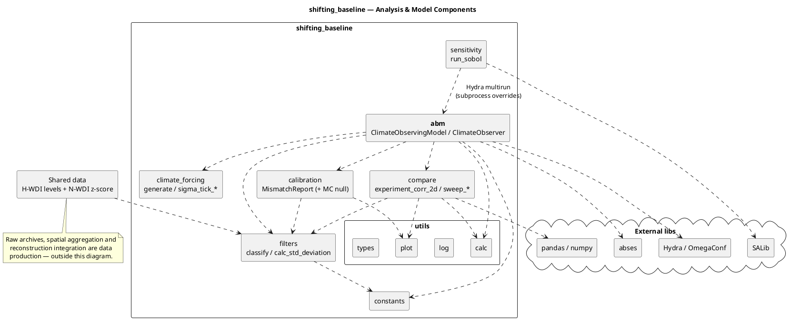
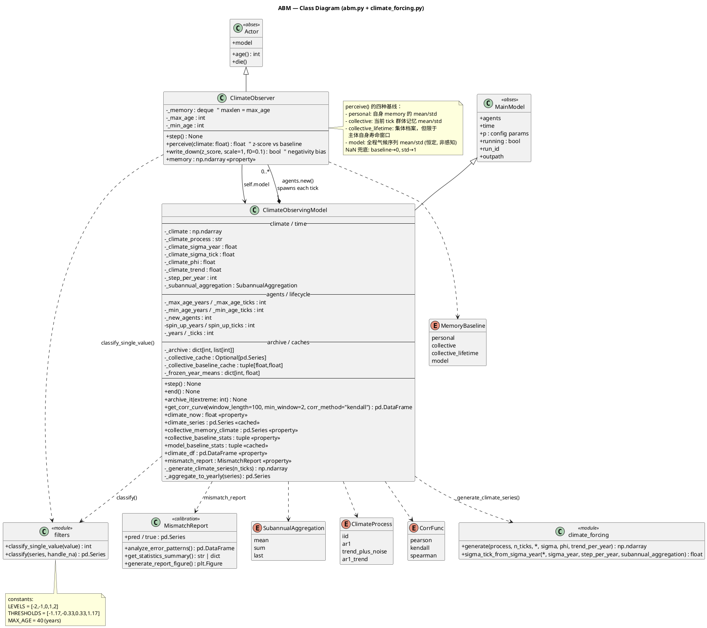
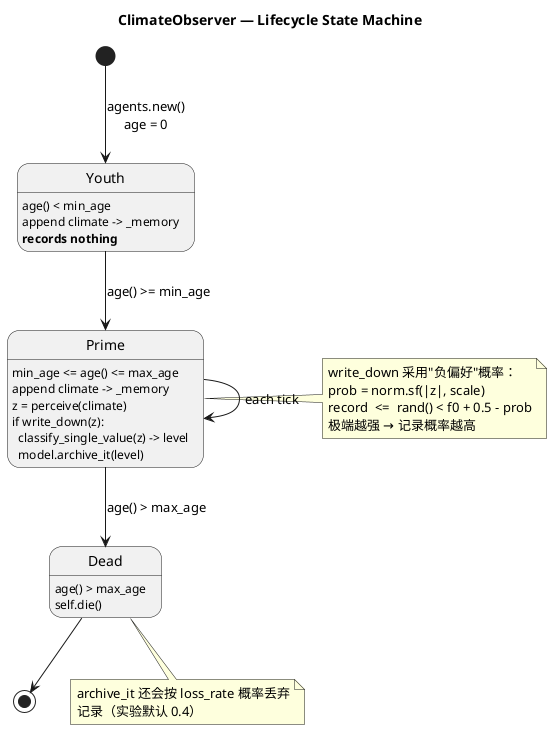
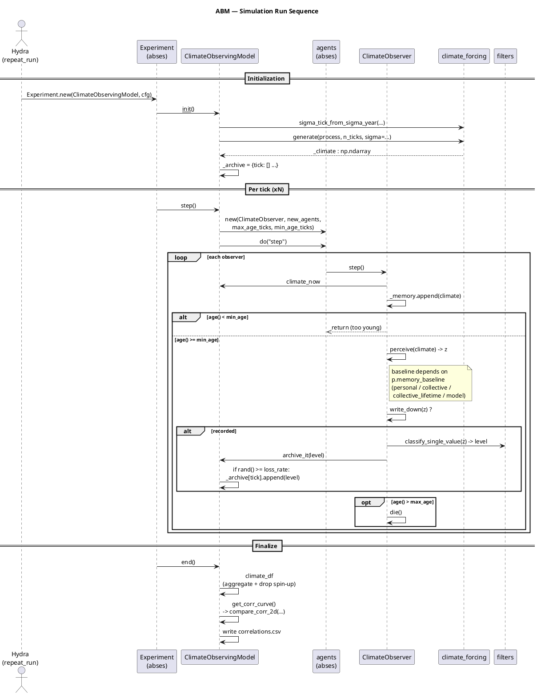

# 架构图 (UML)

本页用 **PlantUML** 描述 `shifting_baseline` 的架构，重点是基于
[`abses`](https://github.com/ABSESpy/ABSES) 框架的多主体模型（ABM）。它也是**为 ABM 搭建
前端 / 部署模型**的参考蓝图（类结构、参数面、运行时序一目了然）。

共四张图，组织为「总览 → ABM 核心」：

1. [组件 / 包总览图](#1-component-overview) — 分析模块与其依赖
2. [ABM 类图](#2-abm-class-diagram) — 模型与观察者主体的类结构（前端最重要的参考）
3. [Observer 生命周期状态图](#3-observer-lifecycle) — 主体的「出生 → 记录 → 死亡」状态机
4. [仿真运行时序图](#4-simulation-sequence) — 一个 tick 与收尾阶段的调用链

---

## 1. 组件 / 包总览图 {#1-component-overview}

分析消费两条[共享序列](../guide/data.md)，运行一条短链：再标准化与分级 → 相关 → 校准 →
用 ABM 验证。原始数据读取、空间聚合、重建整合属于*数据生产*，此处有意省略。

---

## 2. ABM 类图 {#2-abm-class-diagram}

ABM 由两个类构成：`ClimateObservingModel`（继承 `abses.MainModel`）与 `ClimateObserver`
（继承 `abses.Actor`）。模型持有离散气候序列 `_climate` 与逐 tick 档案 `_archive`，每个 tick
生成新的观察者；观察者相对**基线**感知气候 z-score 并按「负偏好」概率记录极端事件。这是
**前端要暴露参数、读取结果**的核心结构。

---

## 3. Observer 生命周期状态图 {#3-observer-lifecycle}

每个 `ClimateObserver` 在每个 tick 都把当前气候压入个人记忆；年龄达到 `min_age` 后才开始按
概率记录事件，超过 `max_age` 即死亡。这一年龄结构正是「基线偏移」机制的载体——年轻主体与
年长主体对同一极端事件的感知不同。

---

## 4. 仿真运行时序图 {#4-simulation-sequence}

下图展示一次实验的调用链：初始化生成气候序列 → 每个 tick 生成主体并令其 `step` → 收尾计算
相关性曲线并输出。`abses.Experiment` 负责按 `repeats / num_process` 批量并行运行。

