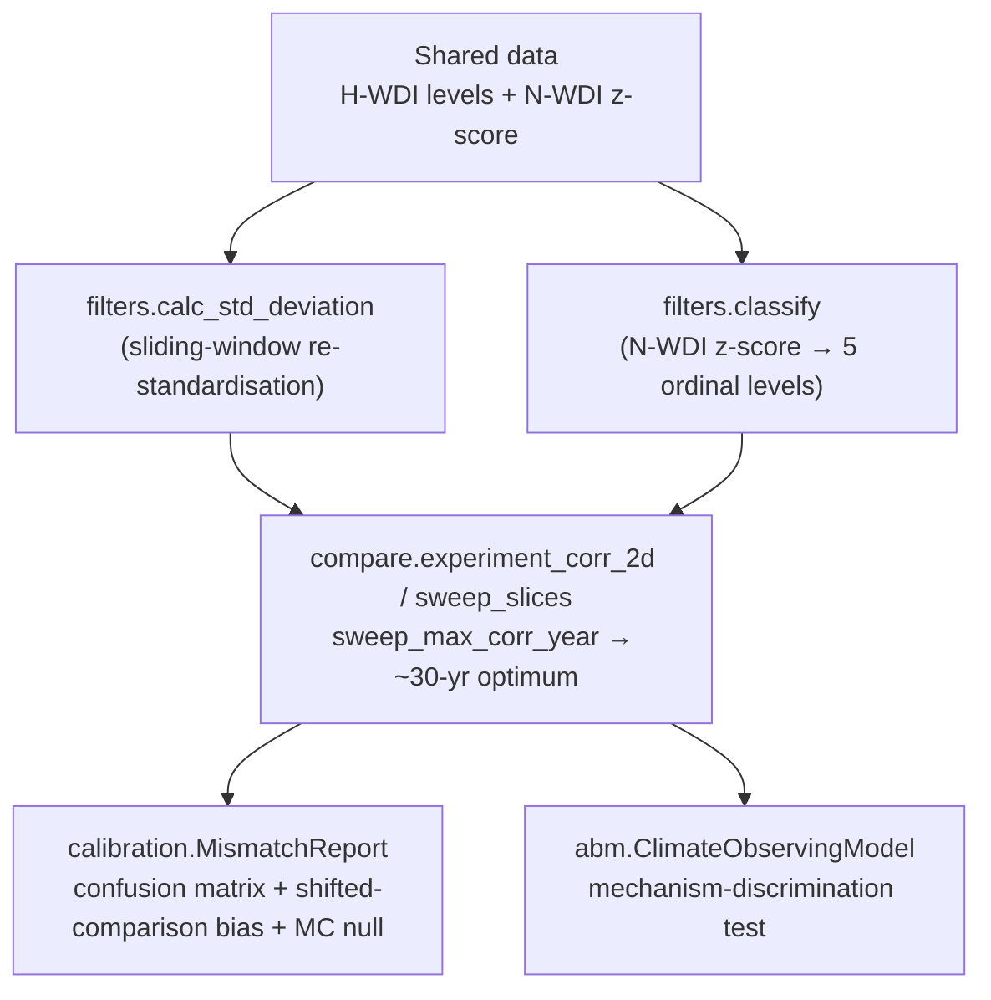

# Analysis Pipeline

Starting from the two [shared series](data.md) (H-WDI levels + N-WDI z-score), the
analysis is a short chain: re-standardise & classify → correlate → calibrate →
validate with the ABM. Each stage maps to a module.

## Stages

### 0. Start from the shared data — [Data & Reproduction](data.md)

Load the regional **H-WDI** (ordinal levels) and the **N-WDI** (continuous z-score),
aligned on their overlapping years. Everything upstream (raw archives, spatial
aggregation, reconstruction integration) is data production and is not part of the
reproducible analysis.

### 1. Re-standardise & classify — [`filters`](../api/filters.md)

- [`calc_std_deviation`][shifting_baseline.filters.calc_std_deviation] — sliding-window
  re-standardisation (`window_size`, `filter_side`). **This is the SBS operation under
  test.**
- [`classify`][shifting_baseline.filters.classify_series] /
  [`classify_single_value`][shifting_baseline.filters.classify_single_value] — turn the
  continuous N-WDI z-score into the five ordinal levels, using empirical thresholds
  (±1.17σ, ±0.33σ) so both series share one grading scheme.

### 2. Correlate & sweep — [`compare`](../api/compare.md)

- [`compare_corr`][shifting_baseline.compare.compare_corr] — one correlation with
  optional filtering.
- `experiment_corr_2d` / `compare_corr_2d` — 2-D correlation surfaces.
- `sweep_slices` — rolling time windows across the record.
- `sweep_max_corr_year` — for each slice, the window size that maximises correlation,
  producing the headline **~30-year optimum** plot.

### 3. Calibrate & test significance — [`calibration`](../api/calibration.md)

[`MismatchReport`][shifting_baseline.calibration.MismatchReport] does confusion-matrix
analysis between the predicted (historical) and true (natural) categorical series:
`analyze_error_patterns()` + `generate_report_figure()`. The shifted-comparison bias is
tested against a Monte-Carlo randomisation null built in via `mc_runs` (default 1000).

### 4. Mechanism test — [`abm`](../api/abm.md)

The ABM reproduces the empirical window–τ pattern under the SBS hypothesis, and it needs
no shared data (it generates its own synthetic climate). See the
**[ABM guide](abm.md)**.

## Reproducibility

The empirical steps above run directly on the two shared series. The ABM fixes its
randomness via `random_seed`, and every ABM run records its resolved config in
`.hydra/config.yaml`.
