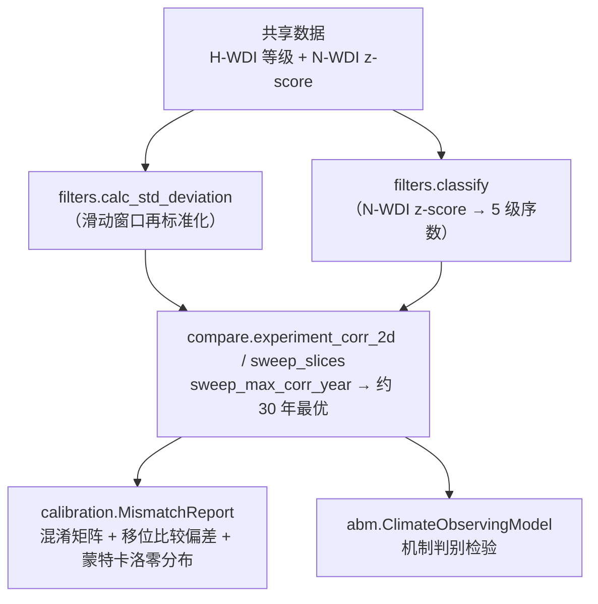

# 分析流水线

从两条[共享序列](data.md)（H-WDI 等级 + N-WDI z-score）出发，分析是一条短链：
再标准化与分级 → 相关 → 校准 → 用 ABM 验证。每个阶段对应一个模块。

## 各阶段

### 0. 从共享数据开始 —— [数据与复现](data.md)

加载区域 **H-WDI**（序数等级）与 **N-WDI**（连续 z-score），在重叠年份上对齐。其上游
（原始档案、空间聚合、重建整合）都属于数据生产，不属于可复现分析。

### 1. 再标准化与分级 —— [`filters`](../api/filters.md)

- [`calc_std_deviation`][shifting_baseline.filters.calc_std_deviation] —— 滑动窗口再标准化
  （`window_size`、`filter_side`）。**这就是被检验的 SBS 操作。**
- [`classify`][shifting_baseline.filters.classify_series] /
  [`classify_single_value`][shifting_baseline.filters.classify_single_value] —— 将连续的
  N-WDI z-score 转为五级序数，采用经验阈值（±1.17σ、±0.33σ），使两条序列共用同一分级方案。

### 2. 相关与扫描 —— [`compare`](../api/compare.md)

- [`compare_corr`][shifting_baseline.compare.compare_corr] —— 单次相关（可选滤波）。
- `experiment_corr_2d` / `compare_corr_2d` —— 二维相关曲面。
- `sweep_slices` —— 沿记录滚动时间窗。
- `sweep_max_corr_year` —— 对每个切片求使相关最大的窗口尺寸，产出标志性的**约 30 年最优**图。

### 3. 校准与显著性检验 —— [`calibration`](../api/calibration.md)

[`MismatchReport`][shifting_baseline.calibration.MismatchReport] 在预测（历史）与真实
（自然）类别序列间做混淆矩阵分析：`analyze_error_patterns()` + `generate_report_figure()`。
移位比较偏差由内置的蒙特卡洛随机化零分布检验（`mc_runs`，默认 1000）。

### 4. 机制检验 —— [`abm`](../api/abm.md)

ABM 在 SBS 假设下复现实证的 窗口–τ 模式，且无需共享数据（自行生成合成气候）。
详见 **[ABM 指南](abm.md)**。

## 可复现性

上述实证步骤直接作用于两条共享序列。ABM 通过 `random_seed` 固定随机性，且每次运行都会把
解析配置记录到 `.hydra/config.yaml`。
